# Offline Billing & Payment Reconciliation

> **Golden Rule:** Workflow online aur offline mein **same** hai. Sirf sync method change hoti hai.  
> Customer kabhi wait nahi karta — cash flow nahi rukta — baad mein system automatically reconcile karta hai.

**Version:** v1.0 · **Date:** June 2026  
**Related:** [`OFFLINE_FIRST_ARCHITECTURE.md`](./OFFLINE_FIRST_ARCHITECTURE.md)

---

## 1. High-Level Overview

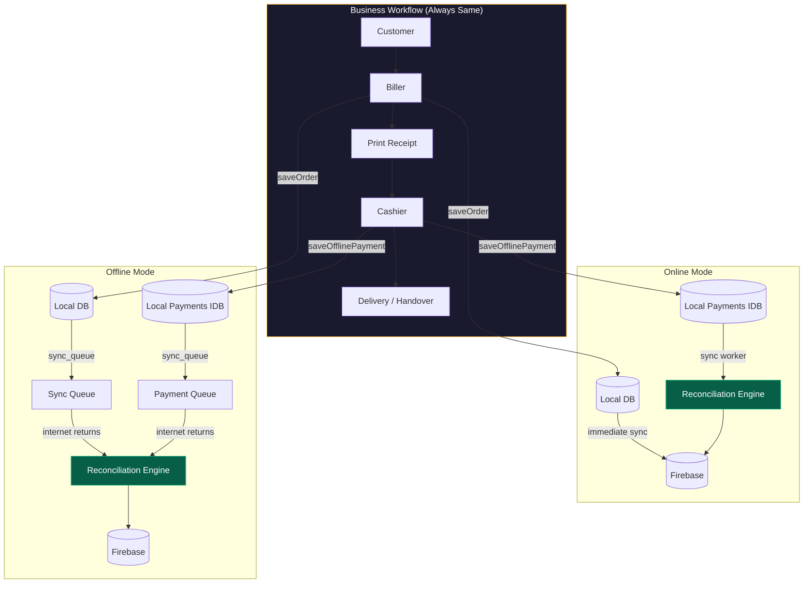

---

## 2. Golden Rule

| Mode | Customer Journey | User Experience |
|------|------------------|-----------------|
| **Online** | Customer → Biller → Cashier → Delivery | Normal — no "offline" message |
| **Offline** | Customer → Biller → Cashier → Delivery | **Identical** — no "offline" message |

**Principle:** Har action pehle **local database** mein save → phir **sync queue** → internet aate hi background sync.

---

## 3. Database Architecture (Independent Entities)

Bills aur Payments alag entities hain. Matching alag collection mein record hoti hai.

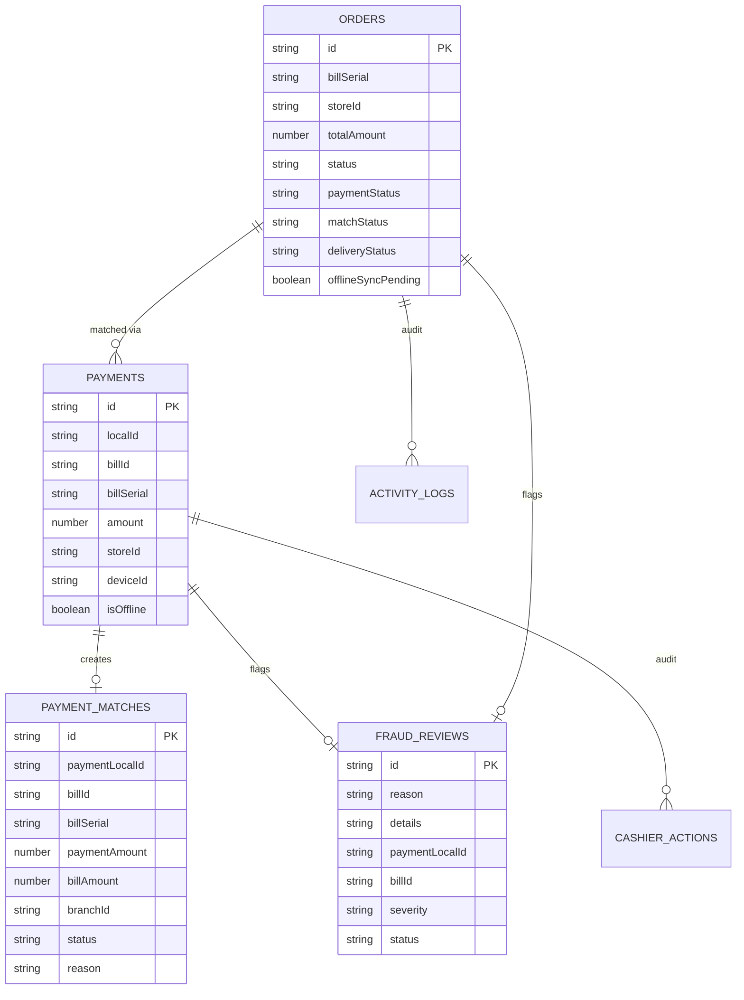

### Local Storage (Device)

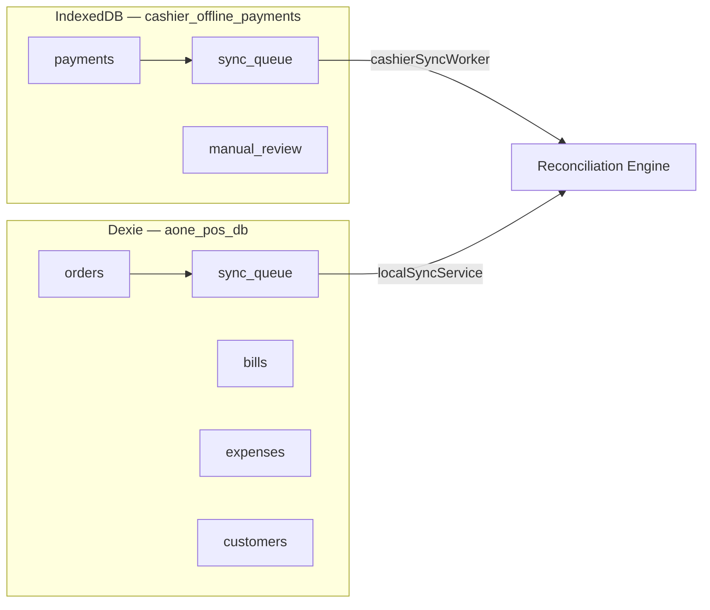

| Store | Database | Purpose |
|-------|----------|---------|
| `orders` | Dexie `aone_pos_db` | Biller offline bills |
| `sync_queue` | Dexie | Bill/expense/customer sync ops |
| `payments` | IDB `cashier_offline_payments` | Cashier offline payments |
| `sync_queue` | IDB | Payment sync queue |
| `manual_review` | IDB | Local mismatch queue |

### Cloud Collections (Firebase)

| Collection | Access | Purpose |
|------------|--------|---------|
| `orders` | All staff | Bills (source of truth) |
| `payments` | All staff | Independent payment records |
| `payment_matches` | Manager+ | Match history & status |
| `fraud_reviews` | Manager+ | Suspicious activity queue |
| `fraudAlerts` | Admin+ | Discount/other fraud (existing) |
| `cashierActions` | Audit | Payment action trail |
| `activityLogs` | Audit | System activity |

---

## 4. Scenario Flows

### Scenario 1 — Biller Offline, Cashier Online

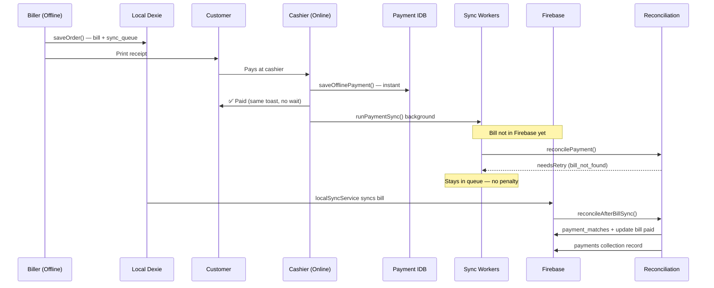

### Scenario 2 — Biller Offline, Cashier Offline

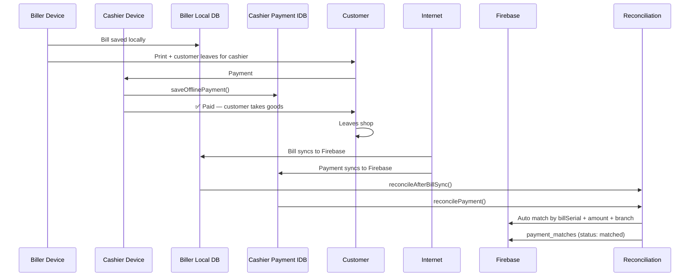

---

## 5. Cashier Payment Flow (Offline-First Always)

Pehle online direct Firebase write hoti thi. Ab **hamesha** same path:

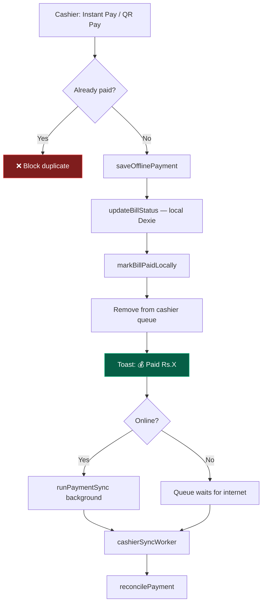

**Key file:** `src/pages/cashier/CashierDashboard.jsx` → `handleInstantPay()`

---

## 6. Sync Queue System

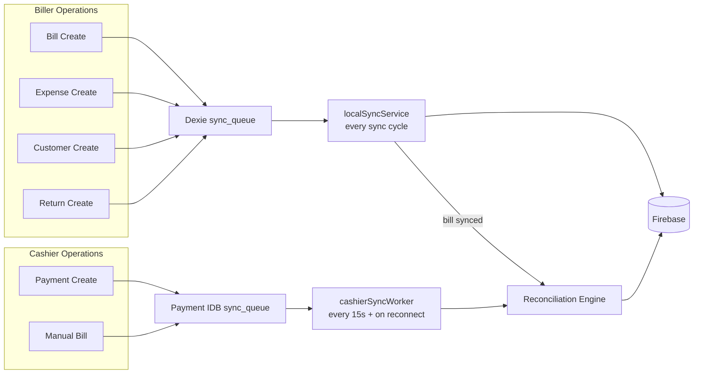

| Worker | Interval | Triggers |
|--------|----------|----------|
| `localSyncService` | On reconnect + manual | Bill sync from Dexie |
| `cashierSyncWorker` | 15s + `online` event | Payment sync from IDB |
| `syncWorker` | Background | Settings, generic ops |

---

## 7. Auto Matching Engine

**File:** `src/services/paymentReconciliationService.js`

### Match Criteria

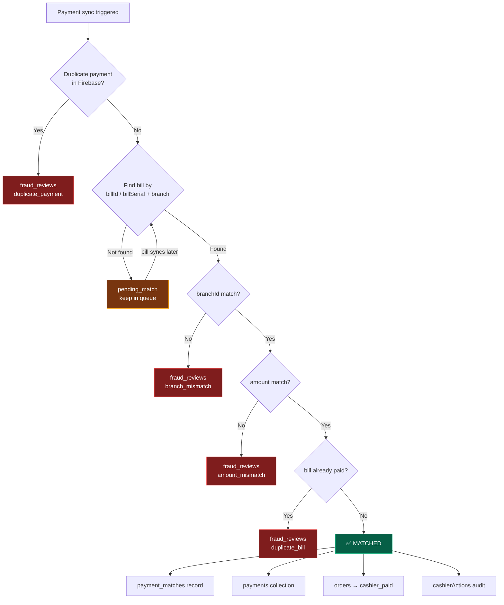

### Match Status Values

| Status | Meaning | Action |
|--------|---------|--------|
| `matched` | Bill + payment aligned | Bill marked paid |
| `pending` | Bill not synced yet | Retry when bill arrives |
| `review_required` | Needs manager review | Manual review panel |
| `fraud` | Suspicious activity | `fraud_reviews` + alert |

### Fraud Reasons

| Code | Trigger |
|------|---------|
| `bill_not_found` | Bill not in Firebase (temporary) |
| `amount_mismatch` | Payment Rs.X ≠ Bill Rs.Y |
| `branch_mismatch` | Wrong store/branch |
| `duplicate_payment` | Same bill paid twice |
| `duplicate_bill` | Bill already fully paid |
| `bill_id_mismatch` | Wrong bill ID |

---

## 8. Fraud Review Flow

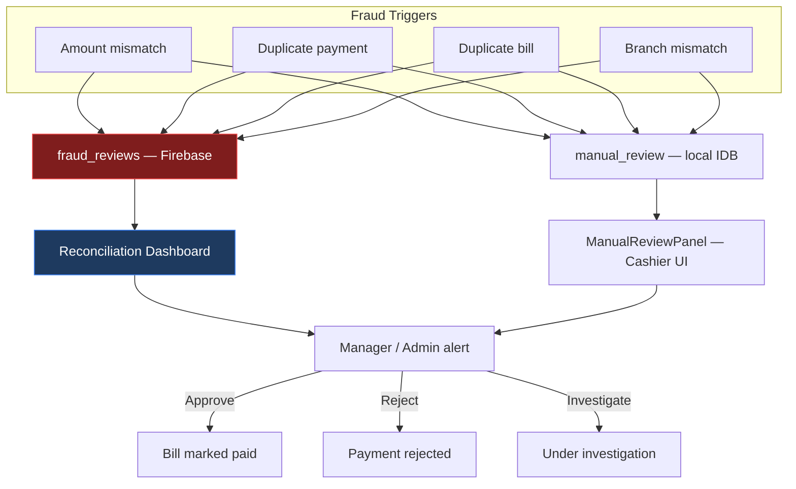

---

## 9. Delivery Security

Product issue karne wale staff ko **sirf status** dikhe — raw bill se maal issue na ho.

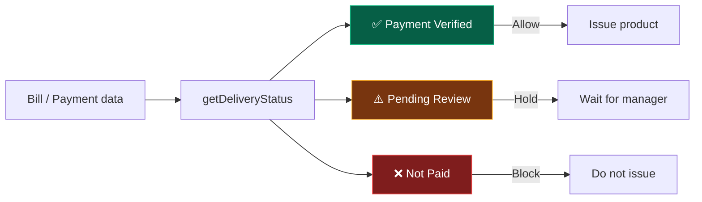

| Status | Label | Product Issue? |
|--------|-------|----------------|
| `payment_verified` | Payment Verified | ✅ Yes |
| `pending_review` | Pending Review | ⚠️ Hold |
| `not_paid` | Not Paid | ❌ Block |

**Files:**
- `src/utils/deliveryStatus.js` — logic
- `src/components/shared/DeliveryStatusBadge.jsx` — UI badge
- `toDeliverySafeView()` — strips sensitive fields for delivery staff

---

## 10. Reconciliation Dashboard

Admin aur Manager ke liye daily audit screen.

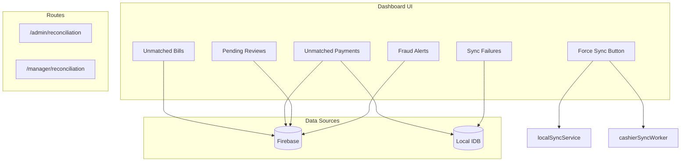

| Stat Card | Source |
|-----------|--------|
| Unmatched Bills | Firebase `orders` where `paymentStatus = pending_payment` |
| Unmatched Payments | Firebase `payments` + local IDB pending |
| Pending Reviews | Firebase `fraud_reviews` where `status = open` |
| Fraud Alerts | High severity `fraud_reviews` |
| Sync Failures | Local queue items with `status = failed` |

**Files:**
- `src/components/reconciliation/ReconciliationDashboard.jsx`
- `src/pages/admin/Reconciliation.jsx`
- `src/pages/manager/Reconciliation.jsx`

---

## 11. File Map

```
src/
├── services/
│   ├── offlinePaymentService.js      # Local payment save + sync queue
│   ├── paymentReconciliationService.js  # ★ Matching engine (NEW)
│   ├── cashierSyncWorker.js          # Payment sync worker (updated)
│   └── localSyncService.js           # Bill sync + reconcileAfterBillSync
│
├── pages/
│   ├── cashier/CashierDashboard.jsx  # Offline-first payment (updated)
│   ├── admin/Reconciliation.jsx      # Admin dashboard page (NEW)
│   └── manager/Reconciliation.jsx    # Manager dashboard page (NEW)
│
├── components/
│   ├── reconciliation/ReconciliationDashboard.jsx  # (NEW)
│   ├── shared/DeliveryStatusBadge.jsx              # (NEW)
│   └── cashier/ManualReviewPanel.jsx               # Local review UI
│
└── utils/
    └── deliveryStatus.js             # Delivery security logic (NEW)

firestore.rules          # payment_matches + fraud_reviews rules
firestore.indexes.json   # Composite indexes for new collections
```

---

## 12. Deploy Checklist

```powershell
# 1. Firestore rules + indexes deploy
firebase deploy --only firestore:rules,firestore:indexes

# 2. App build
npm run build

# 3. Hosting deploy (if needed)
firebase deploy --only hosting
```

---

## 13. Test Checklist

| # | Test | Expected |
|---|------|----------|
| 1 | Biller offline → create bill | Bill in Dexie + print works |
| 2 | Cashier pays (online) | Same toast, no "offline" message |
| 3 | Bill syncs after payment | Auto-match in `payment_matches` |
| 4 | Wrong amount payment | `fraud_reviews` entry created |
| 5 | Duplicate payment attempt | Blocked at local save |
| 6 | Admin dashboard | `/admin/reconciliation` shows stats |
| 7 | Force Sync button | Bills + payments sync |
| 8 | Delivery badge | Shows Verified / Pending / Not Paid |

---

## 14. Known Limitations (Future Work)

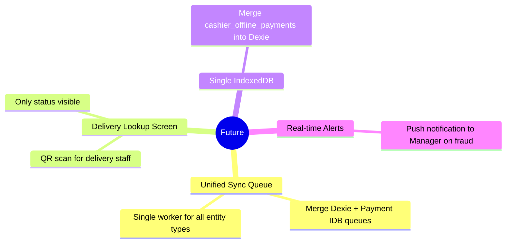

| Item | Status |
|------|--------|
| Unified sync queue (all entity types) | Partial — bills/payments separate paths |
| Dual IndexedDB (Dexie + payment IDB) | Functional, not merged |
| Dedicated delivery lookup screen | Badge ready, screen pending |
| Real-time manager push alerts | Dashboard only (no push yet) |

---

## 15. Quick Reference — Key Functions

| Function | File | Purpose |
|----------|------|---------|
| `saveOfflinePayment()` | `offlinePaymentService.js` | Local save + queue |
| `reconcilePayment()` | `paymentReconciliationService.js` | Match payment → bill |
| `reconcileAfterBillSync()` | `paymentReconciliationService.js` | Match after bill arrives |
| `attemptPaymentMatch()` | `paymentReconciliationService.js` | Core match logic |
| `flagFraudReview()` | `paymentReconciliationService.js` | Create fraud record |
| `getDeliveryStatus()` | `deliveryStatus.js` | Delivery security check |
| `getReconciliationDashboardData()` | `paymentReconciliationService.js` | Dashboard stats |
| `runSync()` | `cashierSyncWorker.js` | Process payment queue |
| `syncOfflineOrders()` | `localSyncService.js` | Process bill queue |

---

*JazakAllah Khair — A One Jewelry POS · Offline-First Reconciliation v1.0*
