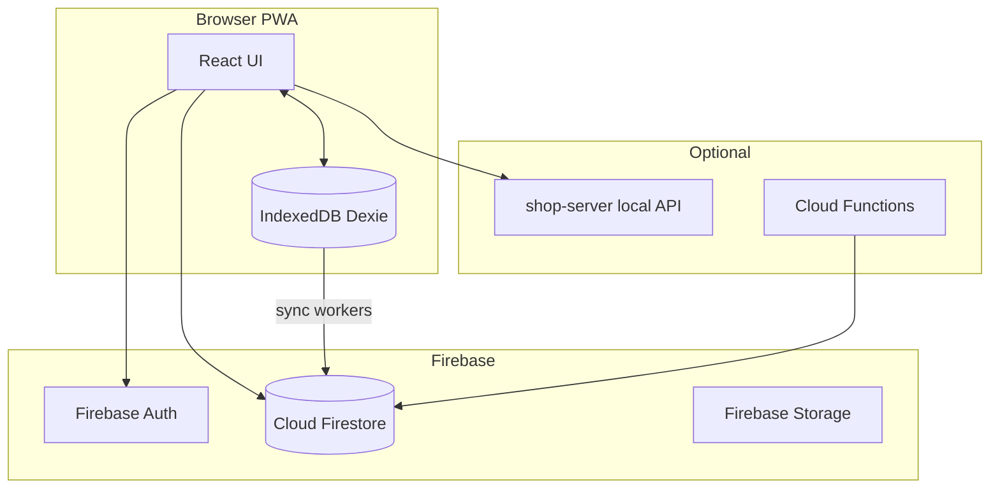
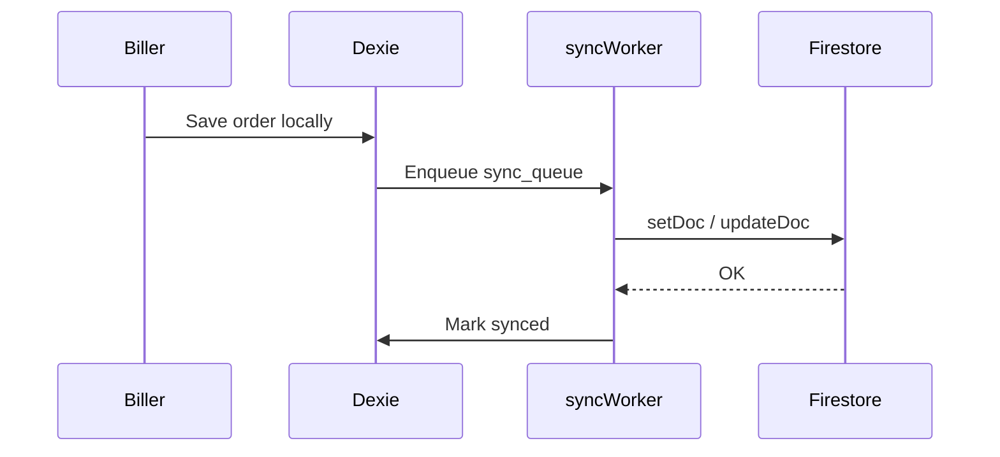

# A One Jewelry POS — Technical Documentation

> **Repository:** `aone-jewelry-pos`  
> **Stack:** React 19 + Vite + Firebase (Auth, Firestore, Storage) + Dexie IndexedDB  
> **Purpose:** Offline-first jewelry point-of-sale with biller, cashier, admin, and manager roles.

---

## 1. Architecture overview



**Offline-first:** Bills are written to IndexedDB first; `syncWorker` / `localSyncService` push to Firestore when online.

---

## 2. Folder structure

```
aone-jewelry-pos/
├── src/
│   ├── main.jsx              # Providers: Auth, Settings, Router, Clerk (optional)
│   ├── App.jsx               # Route definitions
│   ├── pages/
│   │   ├── setup/            # First-time shop setup
│   │   ├── auth/             # Login
│   │   ├── admin/            # Super Admin dashboard & settings
│   │   ├── biller/           # Billing terminal
│   │   ├── cashier/          # Payment collection
│   │   └── manager/          # Branch manager reports
│   ├── components/           # UI by role (admin, biller, cashier, manager, shared, ui)
│   ├── context/              # Auth, Settings, Network, Theme, Language
│   ├── hooks/                # Data hooks per feature
│   ├── services/             # Firebase, sync, backup, payments, etc.
│   ├── db/                   # Dexie schema (index.js)
│   ├── routes/               # SetupRoute, ProtectedRoute, RoleBasedRoute
│   ├── utils/                # Calculations, branch access, formatters
│   └── lang/                 # en.json, ur.json (i18n)
├── functions/                # Firebase Cloud Functions
├── shop-server/              # Optional local shop API
├── firestore.rules           # Security rules
├── firestore.indexes.json
├── firebase.json
└── docs/                     # Migration & master documentation
```

---

## 3. Roles and permissions

| Role | Route prefix | Typical permissions |
|------|--------------|---------------------|
| `superAdmin` | `/admin`, all areas | All branches, all settings |
| `admin` | `/admin` | Elevated admin (subset of super) |
| `manager` | `/manager`, `/biller`, `/cashier` | Single branch scope |
| `biller` | `/biller` | Create bills |
| `cashier` | `/cashier` | Receive payments |

**Branch scoping** (`src/utils/branchAccess.js`):
- **Super Admin / Admin:** `storeIds: null` = all branches
- **Manager:** `restrictToBranch: true`, single `storeId` / `branchId`
- Users may have legacy fields: `storeId`, `storeIds`, `assignedBranches`, `primaryStore`

---

## 4. Authentication flow

1. User opens `/` → `SetupRedirect` checks `isSetupComplete()` → `/setup` or `/login`
2. `LoginPage` → Firebase Auth email/password (or configured provider)
3. After login, Firestore `users` doc loaded by email/uid
4. `RoleBasedRedirect` sends user to role home (`/admin`, `/biller`, `/cashier`, `/manager`)
5. `ProtectedRoute` + `RoleBasedRoute` guard pages by role and permission flags

**Key files:**
- `src/context/AuthContext.jsx`
- `src/services/authService.js`
- `src/utils/rolePermissions.js`
- `src/routes/ProtectedRoute.jsx`, `RoleBasedRoute.jsx`

---

## 5. Firebase Firestore collections

### Core business
| Collection | Purpose |
|------------|---------|
| `users` | Staff accounts, roles, branch assignment |
| `stores` | Branches / shop locations |
| `settings` | Shop config, setup flags, feature toggles |
| `customers` | Customer CRM |
| `orders` | Bills / orders (primary sales entity) |
| `payments` | Payment records linked to orders |
| `products` | Product catalog (light) |
| `inventory` | Stock records |

### Operations
| Collection | Purpose |
|------------|---------|
| `expenses` | Shop expenses |
| `returns` | Return/refund records |
| `commissions` | Salesperson commission |
| `dailySummaries` | Aggregated daily stats |
| `registers` | Cash register sessions |
| `cashTransactions` | Cash in/out |

### Audit & sync
| Collection | Purpose |
|------------|---------|
| `activityLogs` | User activity |
| `auditLogs` | Admin audit trail |
| `cashierActions` | Cashier-specific actions |
| `sync_ops` | Sync operation metadata |
| `deletedBills` | Soft-deleted bill flags |
| `backups` | Cloud backup metadata |

### Migration export (`backupService.js`)
`MIGRATION_COLLECTIONS`:
```
orders, customers, users, stores, settings, payments,
activityLogs, auditLogs, cashierActions, dailySummaries,
expenses, returns, inventory, sync_ops
```
**Limit:** ~2500 documents per collection per export (use bulk export script if exceeded).

---

## 6. IndexedDB (Dexie) — local tables

Database name: `aone_pos_db`

| Store | Purpose |
|-------|---------|
| `orders` | Local bills awaiting sync |
| `bill_items` | Line items per bill |
| `bills` | Legacy bill records |
| `customers` | Local customer cache |
| `payments` | Offline payments |
| `sync_queue` / `sync_queue_local` | Pending Firestore writes |
| `drafts` | Biller tab drafts |
| `held_bills` | Held bills |
| `settings_cache` | Local settings |
| `failedSync` | Failed sync retry queue |
| `commission_transactions` | Local commission queue |
| `activity_logs_local` | Offline activity |

**Schema:** `src/db/index.js` (versioned migrations)

---

## 7. Sync architecture



**Key services:**
- `src/services/syncWorker.js` — main Firestore sync
- `src/services/localSyncService.js` — auto sync on network restore
- `src/services/cashierSyncWorker.js` — cashier-specific sync
- `src/services/settingsSyncWorker.js` — settings pull/push
- `src/services/userSyncService.js` — user directory sync

---

## 8. Application routes

| Path | Page | Roles |
|------|------|-------|
| `/setup` | SetupPage | Pre-setup only |
| `/login` | LoginPage | Public |
| `/admin/*` | AdminDashboard | superAdmin, admin |
| `/biller/*` | BillerDashboard | biller + elevated |
| `/cashier/*` | CashierDashboard | cashier + elevated |
| `/manager/*` | ManagerDashboard | manager + elevated |
| `/dashboard` | RoleBasedRedirect | Authenticated |

---

## 9. Admin module

**Entry:** `src/pages/admin/AdminDashboard.jsx`

| Feature | Page / component |
|---------|------------------|
| Dashboard home | `DashboardHome.jsx` |
| Users | `UserManagement.jsx` |
| Branches | `BranchManagement.jsx` |
| Bills control | `BillsControl.jsx` |
| Customers | `CustomersControl.jsx` |
| Reports | `ReportsAnalytics.jsx` |
| Cash flow | `CashFlowMonitor.jsx` |
| Commission | `CommissionSettings.jsx` |
| Backup & export | `BackupExport.jsx` |
| Migration | `BackupMigratePanel.jsx` |
| Shop settings | `ShopSettings.jsx` |
| Reconciliation | `Reconciliation.jsx` |
| Role permissions | `RolePermissions.jsx` |

---

## 10. Manager module

**Entry:** `src/pages/manager/ManagerDashboard.jsx`

| Page | Purpose |
|------|---------|
| Dashboard | KPIs, branch-scoped |
| Bills | Order list & detail |
| Customers | Branch customers |
| Reports | Sales reports |
| Cash flow | Branch cash flow |
| Credits | Customer credits |
| Expenses | Branch expenses |
| Returns | Returns list |
| Shifts | Shift management |
| Approvals | Discount/cancel approvals |
| Activity logs | Branch activity |
| Reconciliation | Payment reconciliation |

---

## 11. Biller module

**Entry:** `src/pages/biller/BillerDashboard.jsx`

- Multi-tab billing (`useBillerTabs`)
- Item entry, discounts, salesperson, hold bill
- Invoice print (`InvoicePrint.jsx`)
- Local save → sync to Firestore
- Hotkeys (`useBillerHotkeys.js`)

---

## 12. Cashier module

**Entry:** `src/pages/cashier/CashierDashboard.jsx`

- Pending bills from billers
- Payment collection (cash, card, etc.)
- Offline payment modal
- Bill edit, cancel, deleted bill flags
- Recent bills panel

---

## 13. Backup & migration export

**Service:** `src/services/backupService.js`

### Export types
- Full backup JSON
- Per-module CSV / ZIP
- **Migration package:** `buildMigrationExportPayload()` → `downloadMigrationPackage()`

### Migration JSON structure (simplified)
```json
{
  "meta": {
    "exportedAt": "ISO date",
    "backupKind": "migration",
    "collectionCounts": { "orders": 1200, "customers": 400 }
  },
  "collections": {
    "orders": [ { "id": "...", "...fields" } ],
    "stores": [ ],
    "users": [ ]
  },
  "local": {
    "tables": { "orders": [], "customers": [] }
  }
}
```

**UI:** `BackupExport.jsx` → Migrate tab → `BackupMigratePanel.jsx`  
**Roman Urdu helpers:** `src/utils/backupRomanUrdu.js`

---

## 14. UI theme

- **Glass UI:** `src/components/shared/glassUiTheme.js`
- **Global CSS:** `src/styles/index.css`
- **Dark background:** `#0a0805`
- **Accent amber:** `#f59e0b`
- **Components:** `src/components/ui/*` (CenterAlert, PaginationBar, FieldAlertHost)
- **i18n:** English + Urdu (`src/lang/en.json`, `ur.json`)
- **Theme toggle:** `ThemeContext.jsx`
- **Animations:** Framer Motion (select pages)

---

## 15. Key utilities

| File | Purpose |
|------|---------|
| `utils/calculations.js` | Bill totals, discounts, tax |
| `utils/branchAccess.js` | Branch scope resolution |
| `utils/rolePermissions.js` | Role → permission map |
| `utils/formatters.js` | Currency, dates |
| `utils/ordersQueryUtils.js` | Firestore order queries |
| `utils/billsFilterUtils.js` | Admin/manager bill filters |
| `utils/commission.js` | Commission math |
| `utils/deliveryStatus.js` | Order delivery states |

---

## 16. Network & offline

- `NetworkContext.jsx` — online/offline state
- `useOfflinePayments.js` — queue payments offline
- `offlinePaymentService.js` — reconcile when online
- PWA: `vite-plugin-pwa` in `vite.config.js`

---

## 17. Security

- `firestore.rules` — tenant/role-based read/write
- Firebase Auth required for Firestore access
- Super Admin checks in `superAdminUtils.js`
- Activity logging: `activityLogger.js`, `superAdminActivityService.js`

---

## 18. Optional components

| Component | Purpose |
|-----------|---------|
| `shop-server/` | Local Node API for shop LAN |
| `functions/` | Cloud Functions (e.g. user delete) |
| Clerk | `@clerk/clerk-react` optional auth layer (`ClerkAppProvider.jsx`) |

---

## 19. Environment & config

- Firebase config: `src/services/firebase.js`
- Channel config: `src/config/channelConfig.js`
- Shop API: `src/utils/shopApiConfig.js`

Typical `.env` (Vite):
```
VITE_FIREBASE_API_KEY=...
VITE_FIREBASE_PROJECT_ID=...
```

---

## 20. Build & run

```bash
npm install
npm run dev          # http://localhost:5173
npm run build        # production dist/
npm run test         # vitest
npm run shop:server  # optional local shop API
```

---

## 21. Migration to PostgreSQL (new system)

This POS is the **source system**. For the new admin platform:

| Doc | Purpose |
|-----|---------|
| `docs/master/00-MASTER-INDEX.md` | Full A–Z migration package |
| `docs/NEW_SYSTEM_MIGRATION_PLAYBOOK.md` | Short playbook + Cursor prompts |
| `docs/MIGRATION_POSTGRESQL_STEP_ZERO.md` | Step zero (Roman Urdu) |

**Recommended new stack:** Node.js + Express + PostgreSQL + Prisma + JWT (no Firebase on new system).

---

## 22. Troubleshooting (common)

| Issue | Check |
|-------|-------|
| Bills not syncing | `sync_queue` in Dexie; network; `syncWorker` console |
| Wrong branch data | User `storeId` in Firestore `users` |
| Setup loop | `settings/setup` doc `isComplete` |
| Migration export truncated | 2500 limit — bulk export |
| IndexedDB corrupt | Dexie auto-recovery in `db/index.js` |

---

*Last updated: 2026-06-23 · For migration implementation see `docs/master/`.*
