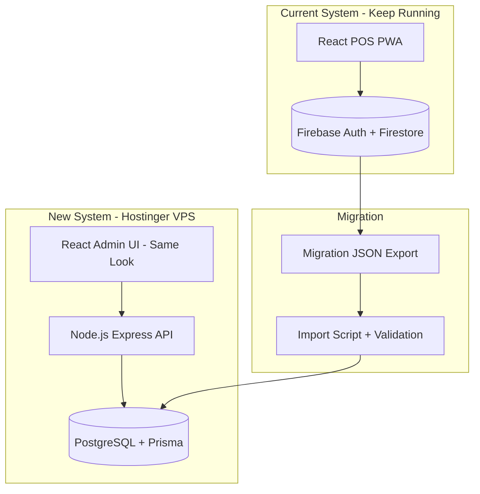

# A One Jewelry — Master Migration & Development Package

> **Version:** 1.0 · **Status:** Production-ready implementation guide  
> **Goal:** Firebase POS → Hostinger VPS + Node.js + PostgreSQL + Prisma + Same UI  
> **AI does 95%+** · **You follow steps + copy Cursor prompts**

---

## How to use this package (beginner)

1. **Pehle** yeh index padho (5 min)  
2. **Part 1** se **Part 8** tak order mein jao  
3. Har part ke end mein **Cursor Prompt** copy-paste karo  
4. **Part 7** = saari prompts ek jagah (quick reference)  
5. Purana POS **band mat karo** jab tak Part 6 testing pass na ho  

---

## Documentation map

| Part | File | Covers |
|------|------|--------|
| **0** | `00-MASTER-INDEX.md` | Yeh file — navigation |
| **1** | `01-ARCHITECTURE-DECISIONS.md` | Architecture, auth choice, setup wizard, permissions |
| **2** | `02-DATABASE-MIGRATION.md` | ER diagram, mapping, Prisma, import, rollback |
| **3** | `03-API-BACKEND.md` | Express REST APIs, JWT, archive, notifications |
| **4** | `04-FRONTEND-UI.md` | Same UI clone, routes, theming, zero visual change rules |
| **5** | `05-VPS-DEPLOYMENT.md` | Hostinger, Ubuntu, Nginx, PM2, SSL, backups |
| **6** | `06-TESTING-OPS.md` | All testing types, monitoring, disaster recovery |
| **7** | `07-CURSOR-PROMPTS-LIBRARY.md` | Copy-paste prompts for every phase |
| **8** | `08-ADMIN-MANAGER-GUIDES.md` | Super Admin + Manager beginner guides (Roman Urdu) |
| **9** | `09-ZERO-TO-LIVE-FULL-MASTER-CHAT.md` | **⭐ ZERO SE LIVE** — VPS steps + GitHub + ALL prompts ek jagah |

---

## New system name (suggested)

**Repository:** `aone-admin-platform`  
**API:** `https://api.yourdomain.com`  
**Web:** `https://admin.yourdomain.com`  

---

## High-level architecture



---

## Role & data scope (after migration)

| Role | Sees | branch filter |
|------|------|---------------|
| Super Admin | All businesses, all branches, all data | None |
| Manager | Own branch only | Automatic `branch_id` |
| Staff | *(optional future)* | Own branch |

**Staff / Biller / Cashier:** Purane POS par rehte hain jab tak billing naye system mein na aaye.

---

## Auth decision (summary — detail in Part 1)

| | Firebase Auth | JWT + PostgreSQL |
|--|---------------|------------------|
| New system has no Firebase | ❌ Extra dependency | ✅ Recommended |
| Cost | Firebase billing | VPS only |
| Migration | Passwords don't export | Temp passwords + reset |
| **Winner for your project** | | **JWT + PostgreSQL** |

---

## Setup wizard decision (summary)

| Condition | Behavior |
|-------------|----------|
| Import has `businesses` + `branches` + `users` | **Auto-skip** setup → `/login` |
| Empty database (fresh VPS) | **Show** one-time setup wizard |
| Implementation | `GET /api/setup/status` → `{ needsSetup: true/false }` |

---

## Your tasks vs AI tasks (whole project)

| You (~5%) | Cursor AI (~95%) |
|-----------|------------------|
| Hostinger VPS purchase | All code, SQL, Prisma, APIs |
| Migration JSON download from old POS | Import scripts, validation |
| Domain DNS point to VPS | Frontend clone + wire API |
| Copy-paste Cursor prompts | Deploy configs, tests, docs |
| Final UAT (click through app) | Monitoring, backup cron scripts |

---

## Phase timeline (suggested 14 days)

| Days | Phase | Part |
|------|-------|------|
| 1 | Export + scaffold repo | 2, 7 |
| 2–3 | PostgreSQL + Prisma + import | 2, 7 |
| 4–6 | API + auth + permissions | 3, 7 |
| 7–9 | Frontend same UI | 4, 7 |
| 10 | Notifications + archive | 3, 7 |
| 11–12 | VPS deploy + SSL | 5, 7 |
| 13 | Full testing | 6, 7 |
| 14 | Go live + parallel run | 6, 8 |

---

## Start here — first 3 actions

### Action 1 (You — 10 min)
Old POS → Super Admin → **Backup → Migrate → JSON Download**

### Action 2 (Cursor — Prompt M1 in Part 7)
```
Read docs/master/00-MASTER-INDEX.md and scaffold aone-admin-platform monorepo per Part 1 architecture.
```

### Action 3 (Cursor — after scaffold)
Run Prompt M2–M4 from Part 7 (database + import + API)

---

## Related existing docs

| File | Purpose |
|------|---------|
| `docs/NEW_SYSTEM_MIGRATION_PLAYBOOK.md` | Short playbook + prompts |
| `docs/MIGRATION_POSTGRESQL_STEP_ZERO.md` | Step zero Roman Urdu |
| `docs/MIGRATION_ROMAN_URDU_POORA_GUIDE.md` | **Poora kaam A–Z Roman Urdu** — aap vs AI har step |
| `docs/TECHNICAL_DOCUMENTATION.md` | Old POS technical reference |

---

**Next file to read:** [`01-ARCHITECTURE-DECISIONS.md`](./01-ARCHITECTURE-DECISIONS.md)
