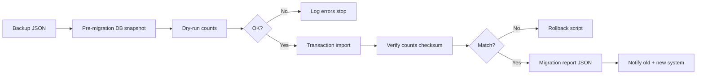

# Part 2 — Database, Mapping & Migration

---

## 2.1 ER diagram (PostgreSQL)

```mermaid
erDiagram
  TENANTS ||--o{ BUSINESSES : has
  BUSINESSES ||--o{ BRANCHES : has
  BRANCHES ||--o{ USERS : employs
  BRANCHES ||--o{ CUSTOMERS : has
  BRANCHES ||--o{ ORDERS : has
  CUSTOMERS ||--o{ ORDERS : places
  ORDERS ||--o{ ORDER_ITEMS : contains
  ORDERS ||--o{ PAYMENTS : has
  BRANCHES ||--o{ EXPENSES : has
  BRANCHES ||--o{ RETURNS : has
  USERS ||--o{ ACTIVITY_LOGS : creates
  ORDERS ||--o{ ARCHIVE_RECORDS : soft_deleted

  TENANTS {
    uuid id PK
    string name
    string slug
  }
  BUSINESSES {
    uuid id PK
    uuid tenant_id FK
    string name
    jsonb raw_firebase
  }
  BRANCHES {
    uuid id PK
    string legacy_firestore_id UK
    string code
    string name
    uuid business_id FK
    boolean is_active
  }
  USERS {
    uuid id PK
    string legacy_firestore_id UK
    string email UK
    string password_hash
    enum role
    uuid branch_id FK nullable
    boolean is_active
  }
  CUSTOMERS {
    uuid id PK
    uuid branch_id FK
    string phone
    string name
    jsonb raw_firebase
  }
  ORDERS {
    uuid id PK
    uuid branch_id FK
    string serial_no
    string status
    decimal final_amount
    timestamptz saved_at
    jsonb raw_firebase
  }
```

---

## 2.2 Firebase → PostgreSQL collection mapping

| Firebase collection | PostgreSQL table(s) | Notes |
|---------------------|---------------------|-------|
| `settings/setup` | `businesses`, `tenants` | Shop name, config |
| `stores` | `branches` | `legacy_firestore_id` = doc id |
| `users` | `users` | Only superAdmin + manager imported |
| `customers` | `customers` | `storeId` → `branch_id` |
| `orders` | `orders`, `order_items` | Line items from `items[]` or Dexie `bill_items` |
| `bills` | `orders` (merge) | Dedupe with orders by serial |
| `payments` | `payments` | Link `order_id` |
| `expenses` | `expenses` | |
| `returns` | `returns` | |
| `activityLogs` | `activity_logs` | |
| `auditLogs` | `activity_logs` | `source='audit'` |
| `cashierActions` | `activity_logs` | `source='cashier'` |
| `dailySummaries` | `daily_summaries` | Optional cache table |
| `commissions` | `commission_transactions` | |
| `deletedBills` | `archive_records` | type=deleted_bill |
| `products` | `products` | Light catalog |
| Dexie `tables.*` | Same tables | Fill gaps cloud missed |

---

## 2.3 Prisma schema (core — AI generates full file)

```prisma
enum UserRole {
  SUPER_ADMIN
  MANAGER
}

model Branch {
  id                 String   @id @default(uuid())
  legacyFirestoreId  String?  @unique
  code               String?
  name               String
  businessId         String
  isActive           Boolean  @default(true)
  createdAt          DateTime @default(now())
  users              User[]
  customers          Customer[]
  orders             Order[]
  @@index([businessId])
}

model User {
  id                 String    @id @default(uuid())
  legacyFirestoreId  String?   @unique
  email              String    @unique
  passwordHash       String
  role               UserRole
  branchId           String?   // null = super admin all branches
  name               String?
  isActive           Boolean   @default(true)
  mustResetPassword  Boolean   @default(true)
  branch             Branch?   @relation(fields: [branchId], references: [id])
}

model Order {
  id            String   @id @default(uuid())
  branchId      String
  serialNo      String?
  customerId    String?
  status        String?
  finalAmount   Decimal  @db.Decimal(14, 2)
  paymentStatus String?
  savedAt       DateTime?
  rawFirebase   Json?
  isArchived    Boolean  @default(false)
  archivedAt    DateTime?
  branch        Branch   @relation(fields: [branchId], references: [id])
  @@index([branchId, savedAt])
  @@index([serialNo])
}
```

---

## 2.4 Migration pipeline (automated)



### Import order (mandatory)
1. `tenants`, `businesses`
2. `branches` ← `collections.stores`
3. `users` (superAdmin, manager only)
4. `customers`
5. `orders` + `order_items`
6. `payments`
7. `expenses`, `returns`
8. `activity_logs`
9. `daily_summaries` (optional)

### Dedupe rules
- **Orders:** key = `serialNo` OR `legacyFirestoreId`; cloud wins over local duplicate
- **Customers:** key = `phone` + `branchId` (normalize phone)
- **Users:** key = `email` lowercase

---

## 2.5 Migration scripts (AI creates)

| Script | Purpose |
|--------|---------|
| `scripts/backup-before-migrate.sh` | `pg_dump` before import |
| `scripts/migrate-from-firebase-json.ts` | Main import |
| `scripts/verify-migration.ts` | Count compare JSON vs PG |
| `scripts/rollback-migration.ts` | Restore pg_dump |
| `scripts/generate-migration-report.ts` | HTML/JSON report |

### Verification checks (automatic)
- `count(orders)` ≥ `collectionCounts.orders` (minus skipped duplicates)
- Sum `final_amount` for date range vs old POS report export
- Every `orders.branch_id` exists in `branches`
- Every `manager.branch_id` not null
- No orphan `payments.order_id`

### Migration report fields
```json
{
  "startedAt": "",
  "completedAt": "",
  "status": "completed|failed|verified",
  "counts": { "branches": 3, "orders": 1200 },
  "errors": [],
  "warnings": ["2500 order limit - run bulk export"],
  "checksum": "sha256..."
}
```

---

## 2.6 Section template — Migration (full 15 points)

### 1. Purpose
Firebase data PostgreSQL mein **bina loss** import karna.

### 2. Why recommended approach
Transactional import per stage + verify + rollback = enterprise safe.

### 3. AI tasks
- All scripts above
- `migration_logs` table
- Idempotent import (re-run safe with `legacy_firestore_id` unique)

### 4. User tasks
- Download migration JSON from old POS
- Place in `data/migration.json`
- Run: `npm run migrate` (AI wires package.json script)

### 5. Expected output
`reports/migration-2026-06-23.json` + console green ✓

### 6. Folder location
`scripts/`, `data/`, `reports/`

### 7. Files created
`migrate-from-firebase-json.ts`, `verify-migration.ts`, etc.

### 8. Commands
```bash
npm run db:backup
npm run migrate:dry-run
npm run migrate
npm run migrate:verify
```

### 9. Verification
Report status `verified`; spot-check 10 random orders in UI

### 10. Common errors
| Error | Fix |
|-------|-----|
| FK violation branch | Import branches first |
| Duplicate email | Merge users script |
| 2500 limit | Bulk export prompt Part 7 M0 |

### 11. Troubleshooting
Check `migration_logs` table for row-level errors

### 12. Best practices
Always `db:backup` before migrate; dry-run first

### 13. Production notes
Run migration in maintenance window; read-only old POS during import optional

### 14. Beginner explanation
JSON = Excel jaisi file; script = wo Excel PostgreSQL mein paste karta hai, row by row, error log ke sath.

### 15. Next step
Part 3 APIs

---

## 2.7 Indexes & optimization

```sql
CREATE INDEX idx_orders_branch_saved ON orders(branch_id, saved_at DESC);
CREATE INDEX idx_customers_branch_phone ON customers(branch_id, phone);
CREATE INDEX idx_activity_branch_time ON activity_logs(branch_id, created_at DESC);
CREATE INDEX idx_orders_serial ON orders(serial_no);
```

**Views (AI creates):**
- `v_daily_sales_by_branch` — reports fast
- `v_manager_dashboard` — manager KPIs

---

## 2.8 Soft delete & archive tables

```prisma
model ArchiveRecord {
  id           String   @id @default(uuid())
  entityType   String   // order, customer, user
  entityId     String
  branchId     String?
  payload      Json     // full snapshot
  deletedBy    String?
  deletedAt    DateTime @default(now())
  restoredAt   DateTime?
  restoredBy   String?
  permanentAt  DateTime?
}
```

**Never hard delete from UI** — `is_archived=true` + `archive_records` row.

---

**Next:** [Part 3 — API & Backend](./03-API-BACKEND.md)
