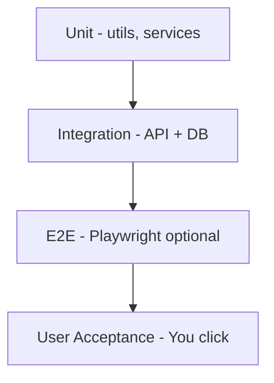

# Part 6 — Testing, Monitoring & Operations

---

## 6.1 Testing pyramid



---

## 6.2 Unit testing

### 1. Purpose
Chhoti functions sahi kaam karein (calculations, branch filter helpers).

### 2. Why Vitest
Fast, same config as Vite web app.

### 3. AI tasks
- `apps/api/tests/unit/branchScope.test.ts`
- `apps/api/tests/unit/dedupeOrders.test.ts`
- `packages/shared/tests/calculations.test.ts` (copy from old `calculations.js`)

### 4. User tasks
Run `npm test` before each deploy

### 5. Expected output
All green

### 8. Commands
```bash
cd apps/api && npm test
cd apps/web && npm test
```

### 10. Common errors
Tests fail on Windows path → use `cross-env`

---

## 6.3 Integration testing (API)

### Test cases (AI implements)
| Test | Assert |
|------|--------|
| Login Super Admin | 200 + JWT |
| Login wrong password | 401 |
| Manager GET /orders | Only own branch |
| Manager GET other branch order | 403 |
| Super Admin GET all branches | 200 |
| Archive customer → restore | Data restored |
| Migration verify | Counts match fixture JSON |

### Commands
```bash
npm run test:integration
# Uses test DB: DATABASE_URL=..._test
```

---

## 6.4 Migration testing

### Checklist
- [ ] Dry-run produces report without DB writes
- [ ] Re-run import is idempotent (no duplicate orders)
- [ ] Rollback restores pre-migration snapshot
- [ ] `verify-migration.ts` exits 0
- [ ] 10 random orders: serial, amount, branch match JSON
- [ ] Manager login: branch matches old Firestore `storeId`
- [ ] Super Admin: total order count ≥ export count minus dedupes

### Fixture
`scripts/fixtures/sample-migration.json` (50 orders) for CI

---

## 6.5 API testing (manual / Postman)

AI generates `docs/master/postman/A-One-Admin-API.json`

Quick smoke:
```bash
TOKEN=$(curl -s -X POST .../auth/login -d '...' | jq -r .token)
curl -H "Authorization: Bearer $TOKEN" .../api/orders?limit=5
```

---

## 6.6 Performance testing

| Area | Target | Tool |
|------|--------|------|
| Login | < 300ms | curl timing |
| Orders list 50 rows | < 500ms | k6 or autocannon |
| Report 30 days | < 2s | API log |

```bash
npx autocannon -c 10 -d 10 -H "Authorization: Bearer $TOKEN" \
  https://api.yourshop.com/api/orders?limit=20
```

**Indexes:** Part 2 — ensure `branch_id + saved_at` index exists.

---

## 6.7 Security testing checklist

- [ ] JWT secret not in git
- [ ] HTTPS only in production
- [ ] Rate limit on login
- [ ] SQL injection: Prisma parameterized (no raw string concat)
- [ ] Manager cannot pass `branchId` header to bypass
- [ ] CORS only your admin domain
- [ ] `helmet()` headers enabled
- [ ] File upload size limit on migration endpoint
- [ ] Passwords bcrypt cost ≥ 10

---

## 6.8 User acceptance testing (UAT) — YOU

### Super Admin (30 min)
1. Login  
2. Dashboard numbers vs old POS (same date range)  
3. Open Bills — search serial  
4. Customers — search phone  
5. Cash flow report  
6. Create manager user  
7. Archive + restore one test customer  

### Manager (20 min)
1. Login  
2. Confirm **only own branch** in dropdown (no other branches)  
3. Try URL hack `?branchId=other` → 403 or ignored  
4. Reports scoped to branch  

### Sign-off
| Tester | Date | Pass/Fail |
|--------|------|-----------|
| Super Admin UAT | | |
| Manager UAT | | |

---

## 6.9 Monitoring & logging

### Application logs
```javascript
// pino or winston
logger.info({ userId, branchId, path }, 'request');
```

PM2: `pm2 logs aone-api --lines 100`

### Metrics to watch
- API 5xx rate
- PostgreSQL connections
- Disk usage (backups)
- SSL expiry (certbot renew cron)

### Disaster recovery

| Scenario | Recovery |
|----------|----------|
| DB corrupted | Restore latest `pg_dump` from `/var/backups/aone` |
| VPS down | Hostinger snapshot restore |
| Bad deploy | `git checkout previous-tag && pm2 restart` |
| Failed migration | `rollback-migration.ts` + fix JSON + re-run |

**RTO target:** 4 hours · **RPO target:** 24 hours (daily backup)

---

## 6.10 Production checklist

- [ ] DNS A records live
- [ ] SSL valid
- [ ] `prisma migrate deploy` on prod
- [ ] Migration import verified
- [ ] All managers password reset
- [ ] Backups cron active
- [ ] UptimeRobot monitoring
- [ ] Old POS still running (parallel)
- [ ] Migration notification sent
- [ ] Rollback script tested once on staging

---

## 6.11 Maintenance guide (ongoing)

| Task | Frequency | Who |
|------|-----------|-----|
| `apt upgrade` security | Weekly | You or script |
| DB backup verify restore | Monthly | You |
| SSL renewal | Auto certbot | — |
| Dependency updates | Monthly | Cursor prompt |
| Log rotation | Auto pm2-logrotate | — |
| Review activity logs | Weekly | Super Admin |

---

## 6.12 Troubleshooting guide

| Symptom | Likely cause | Fix |
|---------|--------------|-----|
| Blank dashboard | API down | `pm2 status` |
| Wrong branch data | JWT stale | Logout/login |
| Slow reports | Missing index | Part 2 indexes |
| 413 upload | Nginx body size | `client_max_body_size 50M` |
| Count mismatch | 2500 export limit | Bulk export script |

---

## 6.13 Section — Go live (15 points)

### 1. Purpose
Safe production launch.

### 2. Why parallel run
Old POS billing continues; new admin for reports only first week.

### 3. AI tasks
Smoke test script `scripts/smoke-production.sh`

### 4. User tasks
UAT sign-off + announce to managers

### 5. Expected output
Both systems running; managers use new admin URL

### 15. Next step
Part 7 Cursor prompts to automate remaining work

---

**Next:** [Part 7 — Cursor Prompts Library](./07-CURSOR-PROMPTS-LIBRARY.md)
